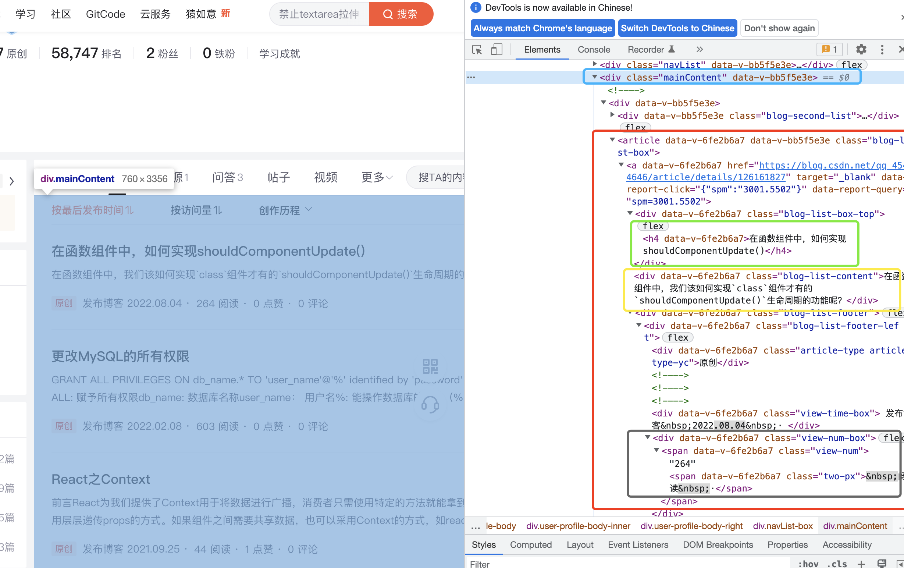

## 前言

`Puppeteer`的中文直译是`操纵木偶的人`，是一个提供顶层`API`来控制基于`DevTools Protocol`的`Chrome/Chromium`的`Node`库。默认，它是运行在`Chrome/Chromium`的`headless`模式下，但是也能改变它的配置，使其运行在`full(non-headless)`模式下。

总结一句话就是，`Puppeteer`就是一个运行在`Node`环境的浏览器

`Puppeteer`为我们提供了丰富的能力，其中包括：
- 为页面生成截图或者`PDF`文件
- 爬取`SPA(Single-Page Application)`或者`SSR(Sever-Side Rendering)`
- 自动表单提交，`UI`测试，键盘输入等
- 使用最新的`JavaScript`和浏览器特性创建一个自动化的测试环境
- 捕获网页的`timeline trace`，帮助诊断性能问题
- 测试`Chrome`插件

而这篇文章主要是介绍上面列出的第二点，抓取页面数据

## 环境搭建
- 首先新建一个项目文件夹叫`puppeteer-crawl-page-example`并初始化项目

```bash
mkdir puppeteer-crawl-page-example
cd puppeteer-crawl-page-example && yarn init -y
```

- 添加`typescript`（当然如果你更喜欢直接使用`javascript`编写项目，可以直接跳过关于`typescript`的配置介绍即可）

```bash
yarn add typescript ts-node nodemon --dev
```
> `ts-node`是为了动态编译`ts`文件为`js`文件，`nodemon`则是为了监听编译后的`js`文件是否发生了变化，从而决定是否重启项目

- 在`package.json`中添加运行命令，其中`index.ts`是一个文件，是我们编写代码的地方
```json
{
  // 省略部分代码
  "script": {
    "start": "nodemon --watch . --exec \"ts-node\" index.ts"
  }
}
```

- 安装`Puppeteer`，当我们安装的时候，它会自动安装一个最新版的`Chromium`，以保证`Puppeteer`能正常的工作，所以对于无法安装的，可能需要借助科学上网工具，当然也有其他解决方式就自行百度啦

```bash
yarn add puppeteer
```

- 安装成功后，在`index.ts`文件中，首先我们需要先启动`(launch)`一个浏览器实例`(Browser)`，也就是调用`Puppeteer`的`launch()`方法创建一个`Browser`对象

> `Puppeteer`的`API`都是`Promise`类型

```typescript
(async function() {
  // 启动一个浏览器, launch接收一个options用于配置信息
  const browser = await puppeteer.launch({
    // 是否在headless模式下运行浏览器
    headless: false,
    // 是否打开Devtool,如果设置为true，headless将强制为false
    devtools: true,
  });

  // 在browser上下文中，创建一个Page对象
  const page = await browser.newPage();

  // 关闭Chromium和所有的Page
  await browser.close();
}());
```

- 启动项目
```bash
yarn run start
```
当看到以下信息，则说明项目启动成功，并且你会看到打开了浏览器，并且马上关闭了
```
$ nodemon --watch . --exec "ts-node" index.ts
[nodemon] 2.0.20
[nodemon] to restart at any time, enter `rs`
[nodemon] watching path(s): *.*
[nodemon] watching extensions: ts,json
[nodemon] starting `ts-node index.ts`
[nodemon] clean exit - waiting for changes before restart
```


## 小试牛刀
我们先来写个简单的截图功能，主要是使用`Page`实例上的`screenshot()`方法
```typescript
// ...

// 加载页面
await page.goto('https://blog.csdn.net/qq_45484646?type=blog', {
  // 超时时间，0为禁用超时
  // timeout: 0,
})

// 对当前页面进行截图
await page.screenshot({
  type: 'png',
  // 保存文件的路径
  path: 'screenshot.png',
  // 截取整个可滚动页面的屏幕截图
  // fullPage: true
});

// ...
```

运行结束后，你会看到在项目的根目录下多了个`screenshot.png`文件，点开你会发现和我们在正常的浏览器中输入的链接加载出来的页面是一模一样，是不是感受到了`Puppeteer`的强大🚀

## 大显神通
接下来，我们可以使用`Puppeteer`来抓取页面信息，但在抓取页面之前我们需要知道要抓取的内容的信息，也就是该怎么访问这些元素。


我们需要获取整个文章列表(也就是`<div class="mainContent"></div>`中的`article`标签中的内容)，并获取每个文章的`title, description`和阅读数。

整个代码如下：

```typescript
// ...

// 加载页面
await page.goto('https://blog.csdn.net/qq_45484646?type=blog', {
  // 超时时间，0为禁用超时
  // timeout: 0,
});

// 相当于浏览器中的document.querySelectorAll，但是返回的是 ElementHandle 类型
const articles = await page.$$('.mainContent article a');
// 用于保存一组Promise，方便Promise.all直接处理
const collects: any[] = [];

// 获取文章信息
for (const article of articles) {    
  // evaluate()，对Page上下文进行计算，并返回一个值
  collects.push(await page.evaluate(article => {
    // 这里的代码是放到Page 上下文中执行的，所以在这里是不能访问外部的作用域（也就是Node环境）

    // 获取文章标题节点
    const title = article.querySelector('h4');
    // 获取文章描述节点
    const description = article.querySelector('.blog-list-content') as HTMLDivElement;
    // 获取文章阅读数节点
    const readNum = article.querySelector('.blog-list-footer .view-num');

    // 提取我们需要的文章信息
    return {
      title: title?.innerText, 
      description: description?.innerText, 
      readNum: readNum?.childNodes[0].textContent,
    };
  }, article));
}

// 等待所有数据成功返回
const data = await Promise.all(collects);

// 输出获取的数据到控制台
console.log('[Data]\t', data);

// ...
```

可以看到控制台输出了我们想要的结果


🎉恭喜，到此为止本篇教程就已结束

〉获取完整代码 https://github.com/yxlazy/puppeteer-crawl-page-example

## 总结
现在我们来做个简单的总结，首先我们简单介绍了`Puppeteer`是什么，它是一个运行在`Node`环境下的浏览器，为我们提供了丰富的能力，例如为页面截图等，然后在这里我们通过介绍如何抓取页面的数据从而简单的感受了`Puppeteer`强大的功能之一

## 参考

[1] https://pptr.dev/
