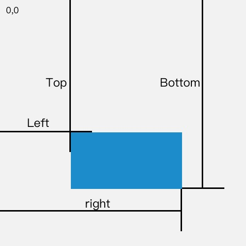

当用户访问一个图片很多的页面，如果不做任何处理，可能等到图片加载完成用户可能早已经离开页面，所以为了留住我们的用户，我们需要对这一过程做一次优化，我们选择'懒加载'的方式来进行优化。

## 何为懒加载？

所谓懒加载，就是延迟加载。我们只选择用户需要看到的东西进行加载，对于用户看不到的东西，也许永远也不需要加载，如果第一次请求就加载所有，不仅浪费带宽，而且可能还会逼走你的用户。

## 视口（viewpoint）

说到懒加载，难免不会提到视口，视口又分为**视觉视口（visual viewport）**和**布局视口（layout viewport）**。视口在浏览器中是指我们正在浏览的一部分，即排除浏览器UI和菜单栏的部分。

`visual viewport` 指当前浏览器中可见的部分，并且可以变化。

`layout viewport`是指 `innerHeight` 和 `innerWidth` 所组成的区域。


获取视口的宽和高：

`document.documentElement.clientWidth`: 获取页面对象的宽度（注：`Element.clientWidth`获得的元素宽度为`content + padding * 2` 但不包含滚动条）

`document.documentElement.clientHeight`: 获取页面对象的高度

`window.innerWidth`: 获取浏览器窗口（`viewpoint`）宽度，包括滚动条

`window.innerHeight`: 获取浏览器窗口（`viewpoint`）高度

`window.outerWidth`: 是指包括了浏览器外边框的窗口宽度 

`window.outerHeight`: 获取整个浏览器窗口的高度（单位：像素），包括侧边栏（如果存在）、窗口镶边（`window chrome`）和窗口调正边框

## Element.getBoundingClientRect()

该方法用于返回某个`ELement`的宽度，高度以及相对于视口的位置。它的返回值是个`DOMRect`对象，其中包含的属性有：

`DOMRect.x`: 指Element的水平坐标

`DOMRect.y`: 指Element的垂直坐标

`DOMRect.top`: 指Element上边缘距离视口顶部的高度

`DOMRect.bottom`: 指Element下边缘距离视口顶部的高度

`DOMRect.left`: 指Element左边缘距离视口左边的宽度

`DOMRect.right`: 指Element右边缘距离视口左边的宽度

`DOMRect.width`: 指Element本身的宽度

`DOMRect.height`: 指Element本身的高度



如果是标准盒子模型，元素的尺寸等于`width/height + padding + border-width`的总和。如果`box-sizing: border-box`，元素的的尺寸等于 `width/height`。

## 实现懒加载

接下来我们来实现一个简单的图片懒加载组件

https://codepen.io/yanxiaolazy/embed/RwZXZPw

```jsx
  React.useEffect(() => {
    const node = ref.current
    if (node) {
      checkVisible(node, setVisible);
    }
  }, []);
```

首次渲染时，加载已经出现在视口中的节点

```jsx
  React.useEffect(() => {
    const node = ref.current
    
    const lazyLoadHandle = () => {
      checkVisible(node, setVisible);
    }
    
    if (node) {
      window.addEventListener('scroll', lazyLoadHandle)
    }
    
    return () => window.removeEventListener('scroll', lazyLoadHandle);
  }, [])
```

首次渲染时绑定滚动事件，用于加载滚动时出现在视口中的节点

```jsx
const checkVisible = (node, callback) => {
  const {top, height} = node.getBoundingClientRect();
  const innerHeight = window.innerHeight;
  top <= innerHeight && (top + height) > 0 &&  callback(true);
}
```

`checkVisible`函数用于判断节点是否已经出现在视口中，其中`top <= innerHeight` 说明该节点出现在了视口中，`(top + height) > 0`说明该节点还未离开视口，接着设置`visible`为`true`加载该节点
